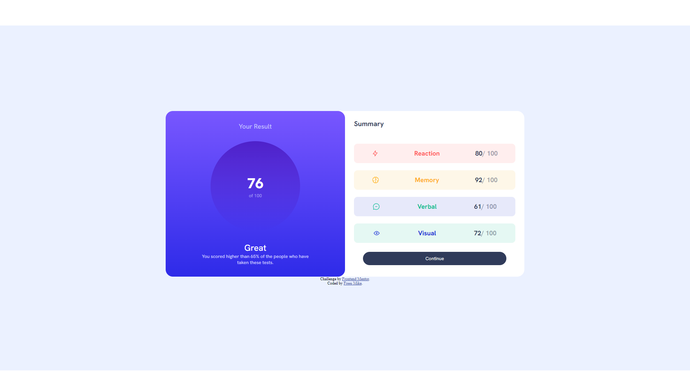

# Frontend Mentor - Results summary component solution

This is a solution to the [Results summary component challenge on Frontend Mentor](https://www.frontendmentor.io/challenges/results-summary-component-CE_K6s0maV). Frontend Mentor challenges help you improve your coding skills by building realistic projects. 

## Table of contents

- [Overview](#overview)
  - [The challenge](#the-challenge)
  - [Screenshot](#screenshot)
  - [Links](#links)
- [My process](#my-process)
  - [Built with](#built-with)
  - [What I learned](#what-i-learned)
  - [Continued development](#continued-development)
- [Author](#author)

## Overview

### The challenge

Users should be able to:

- View the optimal layout for the interface depending on their device's screen size
- See hover and focus states for all interactive elements on the page

### Screenshot

### Links

- Solution URL: [solution URL](https://github.com/mikeFrees/ResultsSummaryComponent)
- Live Site URL: [live site](https://mikefrees.github.io/ResultsSummaryComponent/)

## My process

### Built with

- Semantic HTML5 markup
- CSS custom properties
- Flexbox
- Basic JS
- HTML syntaxt injection via JS
- JSON

### What I learned

I learned allot of new things. How to read and use the JSON format, how to inject a HTML tabl into my html file with JS. And i got a better understanding of the CSS flexbox.

### Continued development

Still doing new research on the flexbox and other CSS parts before moving on to JS.

## Author

- Website - [Frees Mike](https://www.linkedin.com/in/mike-frees/)
- Frontend Mentor - [@mikeFrees](https://www.frontendmentor.io/profile/mikeFrees)
